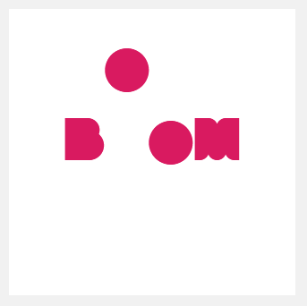
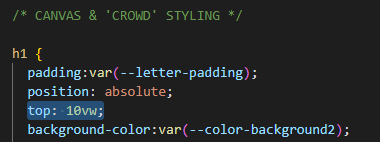

# Procesverslag
**Auteur:** -Thijs Bordewijk-

**De opdrachten:** [opdracht 1](opdracht1/index.html) en [opdracht 2](opdracht2/index.html)

Markdown is een simpele manier om HTML te schrijven.  
Markdown cheat cheet: [Hulp bij het schrijven van Markdown](https://github.com/adam-p/markdown-here/wiki/Markdown-Cheatsheet).

Nb. De standaardstructuur en de spartaanse opmaak van de README.md zijn helemaal prima. Het gaat om de inhoud van je procesverslag. Besteedt de tijd voor pracht en praal aan je website.

Nb. Door *open* toe te voegen aan een *details* element kun je deze standaard open zetten. Fijn om dat steeds voor de relevante stuk(ken) te doen.

## Bronnenlijst
  1. [-Boom chicago-](https://boomchicago.nl/)
  2. [-Light & dark mode-](https://developer.mozilla.org/en-US/docs/Web/CSS/@media/prefers-color-scheme)
  3. [-Transforms- ](https://developer.mozilla.org/en-US/docs/Web/CSS/transform)
  4. [-Animations-](https://developer.mozilla.org/en-US/docs/Web/CSS/CSS_Animations/Using_CSS_animations)

## Opdracht 1 plan

  
uitwerken na schetsen idee (voor week 2)

  ### Idee
  
Het logo dat ik wil gaan animeren is het logo van Comedyclub Boom Chicago in Amsterdam. Het logo is het volgende:

  

  #### Kleuren logo:
  

  ### Je storyboard:
  

  ### Je ambitie: 
  Aan deze technieken/punten wil ik werken:
  - custom properties
  - geen gebruik van margins om elementen te plaatsen
  - echt verschil tussen light & dark mode
  - de letters een goede beweging geven om zo een soort 'persoonlijkheid' aan de letter te kunnen geven
 

## Opdracht 1 reflectie

  
uitwerken bij afronden opdracht (voor week 4)

  ### Je uitkomst - karakteristiek screenshot(s):
  
  
  

  ### Dit ging goed/Heb ik geleerd: 
  Het gebruik van custom properties ging erg goed, ik had ingeschat hier langer voor nodig te hebben maar eigenlijk ging het meteen zoals ik wou dat het ging.
  

  

  ### Dit was lastig/Is niet gelukt:
  Responsive maken met mix-max of clamps. Ik ben er niet aan toe gekomen dit te doen dus heb ik een iets simpelere oplossing gebruikt, namelijk de positionering van het canvas met vw aangeduid in plaats van px.

  Ook had ik liever nog een soort 'spotlight' toegevoegd om de 'o' nog meer een comedian te laten lijken, hier ben ik alleen niet aan toe gekomen
  
  

## Opdracht 2 plan

  
uitwerken na schetsen idee (voor week 5)

  ### Je ontwerp:
  

  ### Je ambitie: 
  Aan deze technieken/punten wil ik werken:
  - punt 1
  - punt 2
  - nog een punt
  - ...

## Opdracht 2 test

  
uitwerken na testen (week 7)

  Neem minimaal 5 bevindingen op:

  ### Bevinding 1:
  Omschrijving van wat er nog niet orde was (tekst en afbeeding(en)).

  #### oplossing:
  Beschrijving hoe je het hebt hebt opgelost of als het niet gelukt is hoe je het zou oplossen (tekst en afbeeding(en)).

  ### Bevinding 2:
  Omschrijving van wat er nog niet orde was (tekst en afbeeding(en)).

  #### oplossing:
  Beschrijving hoe je het hebt hebt opgelost of als het niet gelukt is hoe je het zou oplossen (tekst en afbeeding(en)).

  ### Bevinding 3:
  ...

## Opdracht 2 reflectie

  
uitwerken bij afronden opdracht (voor week 8)

  ### Je uitkomst - karakteristiek screenshot(s):
  

  ### Dit ging goed/Heb ik geleerd: 
  Korte omschrijving met plaatje(s)

  

  ### Dit was lastig/Is niet gelukt:
  Korte omschrijving met plaatje(s)

  

